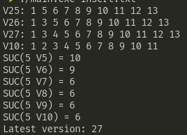

# Partial Persistence

## Relatório

A implementação da ordenação agora está funcionando devidamente, permitindo a inserção de elementos em uma ordem arbitrária e mantendo
a ordem crescente na lista.

Não consegui implementar de maneira 100% correta a funcionalidade. Após alguns testes,
percebi a inserção (até onde testei) está funcionando perfeitamente,porém após algumas
alterações que fiz acabaram quebrando a função de sucessor, que funciona até um certo
momento, mas começa a dar valores inconsistentes após algumas execuções (provavelmente
após atualizar os ponteiros quando a lista de mods está cheia) (**considere para os
seguintes testes o arquivo insert.txt**).

* erro sucessor



O outro erro conhecido está relacionado a remoção. Remover o elemento da cauda ou da raíz, estão funcionando aparentemente ok, porém quando um elemento intermediário é removido, ele acaba causando
alguns problemas na inserção. Acredito que seja algum ponteiro de _backref_ desatualizado que esteja causando esse problema.

## Instruções
Download:

```sh
    git clone https://github.com/luizok/Partial-Persistence.git
```

Build:

```sh
    gcc *.c -o <outfile_name>
```

Run:

```sh
    ./<outfile_name> <filename>
```
